# 图4-1 智能词汇学习系统功能结构图 — 绘图规范

> 本文档供在 Visio、Draw.io、ProcessOn、亿图等绘图工具中绘制功能结构图时参考。结构严格依据开题报告7个功能模块设计。

---

## 一、层级结构说明

- **第0层**：智能词汇学习系统 SmartVocab（根节点）
- **第1层**：7个一级模块
- **第2层**：各模块下的二级功能
- **第3层**：二级功能下的三级子功能（可选细化）

---

## 二、节点与连接清单（供绘图时逐项添加）

### 第1层 — 7个一级模块

| 序号 | 模块名称 |
|:----:|----------|
| 1 | 基本信息管理 |
| 2 | 评测模块 |
| 3 | 学习计划模块 |
| 4 | 单词学习模块 |
| 5 | 智能复习模块 |
| 6 | 智能单词测试 |
| 7 | 系统集成 |

---

### 第2、3层 — 各模块子功能树

#### 1. 基本信息管理
- 词库管理
  - 导入
  - 查询
  - 更新
  - 删除
  - 批量导入
  - 导出
  - 备份
- 学员管理
  - 注册
  - 登录
  - 信息查询
  - 信息修改
  - 密码加密
  - 会话管理
  - 密码重置
- 词库等级管理
  - CEFR分类
  - 难度分级
  - 多套词库
  - 等级筛选

#### 2. 评测模块
- 等级测试
  - 抽题组卷
  - 选择题
  - 翻译题
  - 拼写题
  - 自动计分
- 统计分析
  - 成绩统计
  - 正确率统计
  - 进度报告
  - 可视化展示
- 评测结果处理
  - 掌握程度计算
  - 达标判断
  - 计划依据

#### 3. 学习计划模块
- 新学计划生成
  - 难度推荐
  - 数量推荐
  - 时间安排
  - 目标设定
- 复习计划生成
  - 遗忘曲线应用
  - 复习时间安排
  - 复习内容排序
  - 紧急程度排序
- 计划动态调整
  - 进度跟踪
  - 动态增减
  - 可执行性保障

#### 4. 单词学习模块
- 闯关模式
  - 关卡划分
  - 解锁条件
  - 进度记录
  - 完成统计
- 随机记忆模式
  - 浏览模式
  - 学习模式
  - 标记收藏
  - 展示调整
- 测试模式
  - 选择题
  - 翻译题
  - 拼写题
  - 掌握更新

#### 5. 智能复习模块
- 复习内容推荐
  - 识别待复习
  - 优先级排序
  - 推荐展示
- 复习计划制定
  - 每日数量
  - 时间安排
  - 手动调整
- 学习情况分析
  - 数据统计
  - 薄弱识别
  - 学习报告

#### 6. 智能单词测试
- 遗忘曲线计算
  - 记忆衰减模型
  - 预测最佳复习时间
  - 间隔计算
- 智能测试生成
  - 自动生成
  - 记忆状态触发
  - 结果更新
- 复习调度优化
  - 动态间隔
  - 个性化参数
  - 策略优化

#### 7. 系统集成
- 前后端分离
  - RESTful API
  - Flask Blueprint
- 深度学习集成
  - 双塔模型
  - 多算法融合
- 数据库集成
  - 核心表结构
  - CRUD操作
- 测试与优化
  - 集成测试
  - 性能优化

---

## 三、绘图步骤建议

1. **创建根节点**：智能词汇学习系统 SmartVocab
2. **创建7个一级子节点**：从根节点向下连接
3. **为每个一级节点创建二级子节点**：如“词库管理”“学员管理”等
4. **为每个二级节点创建三级子节点**：如“导入”“查询”等
5. **统一连线**：自上而下直线连接，保持层次清晰
6. **统一格式**：同级节点同字体、同大小，层次分明

---

## 四、布局参考（公证系统模板风格）

- 根节点居中顶部
- 7个一级模块横向排列，或分两行（如 4+3）
- 每个一级模块下，二级功能纵向排列
- 三级功能可适当收拢，或采用折叠式展开

---

## 五、Mermaid 源码（可导出为图）

```mermaid
flowchart TB
    Root["智能词汇学习系统 SmartVocab"]
    
    M1["1. 基本信息管理"]
    M2["2. 评测模块"]
    M3["3. 学习计划模块"]
    M4["4. 单词学习模块"]
    M5["5. 智能复习模块"]
    M6["6. 智能单词测试"]
    M7["7. 系统集成"]
    
    Root --> M1 & M2 & M3 & M4 & M5 & M6 & M7
    
    M1 --> M1A["词库管理"] & M1B["学员管理"] & M1C["词库等级管理"]
    M1A --> M1A1["导入"] & M1A2["查询"] & M1A3["更新"] & M1A4["删除"] & M1A5["批量导入"] & M1A6["导出"] & M1A7["备份"]
    M1B --> M1B1["注册"] & M1B2["登录"] & M1B3["信息查询"] & M1B4["信息修改"] & M1B5["密码加密"] & M1B6["会话管理"] & M1B7["密码重置"]
    M1C --> M1C1["CEFR分类"] & M1C2["难度分级"] & M1C3["多套词库"] & M1C4["等级筛选"]
    
    M2 --> M2A["等级测试"] & M2B["统计分析"] & M2C["评测结果处理"]
    M2A --> M2A1["抽题组卷"] & M2A2["选择题"] & M2A3["翻译题"] & M2A4["拼写题"] & M2A5["自动计分"]
    M2B --> M2B1["成绩统计"] & M2B2["正确率统计"] & M2B3["进度报告"] & M2B4["可视化展示"]
    M2C --> M2C1["掌握程度计算"] & M2C2["达标判断"] & M2C3["计划依据"]
    
    M3 --> M3A["新学计划生成"] & M3B["复习计划生成"] & M3C["计划动态调整"]
    M3A --> M3A1["难度推荐"] & M3A2["数量推荐"] & M3A3["时间安排"] & M3A4["目标设定"]
    M3B --> M3B1["遗忘曲线应用"] & M3B2["复习时间安排"] & M3B3["复习内容排序"] & M3B4["紧急程度排序"]
    M3C --> M3C1["进度跟踪"] & M3C2["动态增减"] & M3C3["可执行性保障"]
    
    M4 --> M4A["闯关模式"] & M4B["随机记忆模式"] & M4C["测试模式"]
    M4A --> M4A1["关卡划分"] & M4A2["解锁条件"] & M4A3["进度记录"] & M4A4["完成统计"]
    M4B --> M4B1["浏览模式"] & M4B2["学习模式"] & M4B3["标记收藏"] & M4B4["展示调整"]
    M4C --> M4C1["选择题"] & M4C2["翻译题"] & M4C3["拼写题"] & M4C4["掌握更新"]
    
    M5 --> M5A["复习内容推荐"] & M5B["复习计划制定"] & M5C["学习情况分析"]
    M5A --> M5A1["识别待复习"] & M5A2["优先级排序"] & M5A3["推荐展示"]
    M5B --> M5B1["每日数量"] & M5B2["时间安排"] & M5B3["手动调整"]
    M5C --> M5C1["数据统计"] & M5C2["薄弱识别"] & M5C3["学习报告"]
    
    M6 --> M6A["遗忘曲线计算"] & M6B["智能测试生成"] & M6C["复习调度优化"]
    M6A --> M6A1["记忆衰减模型"] & M6A2["预测最佳复习时间"] & M6A3["间隔计算"]
    M6B --> M6B1["自动生成"] & M6B2["记忆状态触发"] & M6B3["结果更新"]
    M6C --> M6C1["动态间隔"] & M6C2["个性化参数"] & M6C3["策略优化"]
    
    M7 --> M7A["前后端分离"] & M7B["深度学习集成"] & M7C["数据库集成"] & M7D["测试与优化"]
    M7A --> M7A1["RESTful API"] & M7A2["Flask Blueprint"]
    M7B --> M7B1["双塔模型"] & M7B2["多算法融合"]
    M7C --> M7C1["核心表结构"] & M7C2["CRUD操作"]
    M7D --> M7D1["集成测试"] & M7D2["性能优化"]
```

可将上述 Mermaid 代码粘贴至 Typora、VS Code Mermaid 插件或在线 Mermaid 编辑器，导出为 PNG/SVG 后插入论文。
