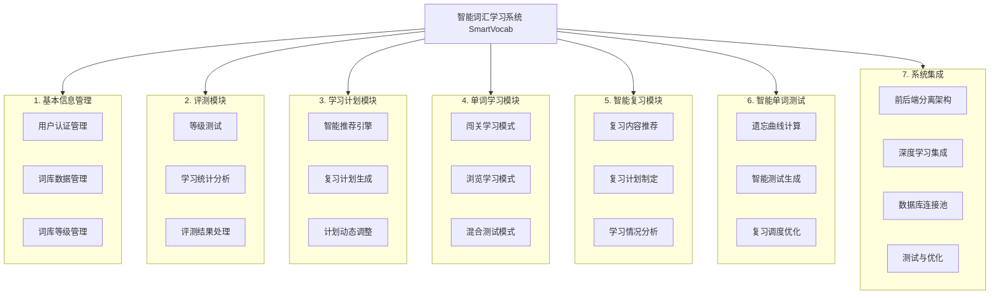

# 图4-1 智能词汇学习系统功能结构图

> 本图基于系统实际代码实现分析绘制，准确反映系统功能模块划分与层级关系。可在 Visio、Draw.io、ProcessOn 等绘图工具中重绘，或使用下方 Mermaid 源码导出为 PNG/SVG 插入论文。

---

## 一、Mermaid 源码（可导出为图）

将下方代码粘贴至 Typora、VS Code Mermaid 插件或 [Mermaid Live Editor](https://mermaid.live/) 即可渲染并导出为图片。

### 版本一：精简版（推荐，适合论文插图）

仅展示根节点、7 个一级模块及二级功能，尺寸适中、易排版。三级功能详见 4.1.2 节表格。



### 版本二：完整版（含三级功能，图幅较大）

若需在图中展示全部三级子功能，可使用本版本。导出后可适当缩放以适配版面。

```mermaid
flowchart TB
    Root["智能词汇学习系统 SmartVocab"]
    Root --> M1 & M2 & M3 & M4 & M5 & M6 & M7

    subgraph M1["1. 基本信息管理"]
        direction TB
        M1A[用户认证管理] --> M1A1[用户注册/用户登录/密码加密/会话管理]
        M1B[词库数据管理] --> M1B1[词汇导入/词汇查询/词汇更新/词汇导出]
        M1C[词库等级管理] --> M1C1[CEFR分类/难度分级/多套词库/等级筛选]
    end

    subgraph M2["2. 评测模块"]
        direction TB
        M2A[等级测试] --> M2A1[抽题组卷/选择题/翻译题/拼写题/自动计分]
        M2B[学习统计分析] --> M2B1[成绩统计/正确率/进度报告/可视化]
        M2C[评测结果处理] --> M2C1[掌握程度计算/达标判断/计划依据]
    end

    subgraph M3["3. 学习计划模块"]
        direction TB
        M3A[智能推荐引擎] --> M3A1[难度推荐/词频推荐/历史推荐/深度学习推荐]
        M3B[复习计划生成] --> M3B1[遗忘曲线/复习时间/内容排序/紧急程度]
        M3C[计划动态调整] --> M3C1[进度跟踪/动态增减/可执行性保障]
    end

    subgraph M4["4. 单词学习模块"]
        direction TB
        M4A[闯关学习模式] --> M4A1[关卡划分/解锁条件/进度记录/完成统计]
        M4B[浏览学习模式] --> M4B1[浏览模式/标记认识/标记不认识/展示调整]
        M4C[混合测试模式] --> M4C1[选择题/翻译题/掌握度更新/会话管理]
    end

    subgraph M5["5. 智能复习模块"]
        direction TB
        M5A[复习内容推荐] --> M5A1[识别待复习/优先级排序/推荐展示]
        M5B[复习计划制定] --> M5B1[每日数量/时间安排/手动调整]
        M5C[学习情况分析] --> M5C1[数据统计/薄弱识别/学习报告]
    end

    subgraph M6["6. 智能单词测试"]
        direction TB
        M6A[遗忘曲线计算] --> M6A1[记忆衰减模型/预测复习时间/间隔计算]
        M6B[智能测试生成] --> M6B1[自动生成/记忆状态触发/结果更新]
        M6C[复习调度优化] --> M6C1[动态间隔/个性化参数/策略优化]
    end

    subgraph M7["7. 系统集成"]
        direction TB
        M7A[前后端分离架构] --> M7A1[RESTful API/Flask Blueprint/CORS跨域]
        M7B[深度学习集成] --> M7B1[双塔模型/多算法融合/用户特定模型]
        M7C[数据库连接池] --> M7C1[核心表结构/CRUD操作/连接池管理]
        M7D[测试与优化] --> M7D1[集成测试/性能优化/错误处理]
    end
```



---

## 二、文本版功能结构图（可直接用于论文插图或绘图参考）

```
                                    智能词汇学习系统 SmartVocab
                                                    │
    ┌─────────────┬─────────────┬─────────────┬─────────────┬─────────────┬─────────────┬─────────────┐
    │             │             │             │             │             │             │             │
基本信息管理    评测模块    学习计划模块  单词学习模块  智能复习模块  智能单词测试  系统集成
    │             │             │             │             │             │             │
    ├─用户认证    ├─等级测试    ├─智能推荐    ├─闯关学习    ├─复习内容    ├─遗忘曲线    ├─前后端分离
    │  ├─用户注册  │  ├─抽题组卷  │  ├─难度推荐  │  ├─关卡划分  │  ├─识别待复习  │  ├─记忆衰减   │  ├─RESTful API
    │  ├─用户登录  │  ├─选择题    │  ├─词频推荐  │  ├─解锁条件  │  ├─优先级排序  │  ├─预测最佳   │  ├─Flask Blueprint
    │  ├─密码加密  │  ├─翻译题    │  ├─历史推荐  │  ├─进度记录  │  └─推荐展示    │  │  复习时间   │  ├─CORS跨域
    │  ├─会话管理  │  ├─拼写题    │  └─深度学习  │  └─完成统计  │             │  └─间隔计算   │  │
    │  └─信息管理  │  └─自动计分  │    推荐     │             │             │             │  ├─深度学习集成
    │             │             │             │             │             │             │  ├─双塔模型
    ├─词库数据    ├─学习统计    ├─复习计划    ├─浏览学习    ├─复习计划    ├─智能测试    │  ├─多算法融合
    │  ├─词汇导入  │  ├─成绩统计  │  ├─遗忘曲线  │  ├─浏览模式  │  ├─每日数量   │  ├─自动生成   │  ├─用户特定模型
    │  ├─词汇查询  │  ├─正确率    │  ├─复习时间  │  ├─标记认识  │  ├─时间安排   │  ├─记忆状态   │  │
    │  ├─词汇更新  │  ├─进度报告  │  ├─内容排序  │  ├─标记不认识│  └─手动调整   │  │  触发       │  ├─数据库连接池
    │  └─词汇导出  │  └─可视化    │  └─紧急程度  │  └─展示调整  │             │  └─结果更新   │  ├─核心表结构
    │             │             │             │             │             │             │  ├─CRUD操作
    └─词库等级    └─评测结果    └─计划调整    └─混合测试    └─学习分析    └─调度优化    │  └─连接池管理
       ├─CEFR分类  ├─掌握程度  ├─进度跟踪  ├─选择题    ├─数据统计   ├─动态间隔   │
       ├─难度分级  ├─达标判断  ├─动态增减  ├─翻译题    ├─薄弱识别   ├─个性化参数 │  └─测试与优化
       ├─多套词库  └─计划依据  └─可执行性  ├─掌握度更新  └─学习报告   └─策略优化   ├─集成测试
       └─等级筛选                          └─会话管理                          ├─性能优化
                                                                              └─错误处理
```

**图4-1 智能词汇学习系统功能结构图**

---

## 三、系统架构说明

### 3.1 技术栈

**后端技术栈：**
- Web框架：Flask 2.3.2 + Flask-RESTful + Flask-CORS
- 数据库：MySQL 8.0 + mysql-connector-python
- 深度学习：PyTorch 2.5.1 + NumPy + Pandas
- 密码加密：bcrypt 4.0.1

**前端技术栈：**
- 原生JavaScript（无框架依赖）
- HTML5 + CSS3
- Fetch API（异步请求）

### 3.2 核心模块说明

| 模块 | 核心文件 | 主要功能 |
|------|---------|---------|
| 用户认证 | [user_auth.py](file:///e:/项目代码/SmartVocab/core/auth/user_auth.py) | 用户注册、登录、密码加密 |
| 词汇学习 | [vocabulary_learning_manager.py](file:///e:/项目代码/SmartVocab/core/vocabulary/vocabulary_learning_manager.py) | 学习会话管理、答题处理 |
| 推荐引擎 | [recommendation_engine.py](file:///e:/项目代码/SmartVocab/core/recommendation/recommendation_engine.py) | 多算法融合推荐 |
| 深度学习 | [deep_learning_recommender.py](file:///e:/项目代码/SmartVocab/core/recommendation/deep_learning_recommender.py) | 双塔模型推荐 |
| 遗忘曲线 | [forgetting_curve_manager.py](file:///e:/项目代码/SmartVocab/core/forgetting_curve/forgetting_curve_manager.py) | 复习时间计算 |
| 数据库连接池 | [database.py](file:///e:/项目代码/SmartVocab/tools/database.py) | 连接池管理、CRUD基础类 |

### 3.3 数据流转关系

```
前端界面 → API路由层 → 核心业务层 → 工具层(CRUD) → 数据库
    ↓           ↓           ↓            ↓
 用户交互   请求分发   业务逻辑处理   数据持久化
```

---

## 四、绘图工具重绘说明

若在 **Visio**、**Draw.io**、**ProcessOn**、**亿图** 等工具中重绘，请参考 `图4-1-系统功能结构图-绘图规范.md`，内含逐项节点清单与层级关系，便于按模板风格绘制。

绘图步骤建议：
1. 创建根节点：智能词汇学习系统 SmartVocab
2. 创建 7 个一级子节点并连线
3. 为每个一级节点创建二级子节点
4. 为每个二级节点创建三级子节点
5. 统一字体与连线样式，保持层次清晰
