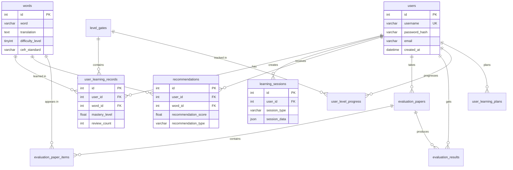

# 图4-2 智能词汇学习系统数据库表结构设计

> 本文档详细描述系统数据库的11张核心数据表结构，包括字段定义、约束条件、主外键关系及字段说明。建表脚本见 `数据库建表脚本.sql`。

---

## 一、数据库概述

### 1.1 数据库基本信息
- **数据库名称**：smartvocab
- **字符集**：utf8mb4
- **排序规则**：utf8mb4_unicode_ci
- **存储引擎**：InnoDB
- **表数量**：11张核心表

### 1.2 表清单

| 序号 | 表名 | 中文名称 | 说明 |
|------|------|----------|------|
| 1 | users | 用户表 | 存储系统用户的基本信息和认证数据 |
| 2 | words | 词汇表 | 存储英语词汇的详细信息 |
| 3 | user_learning_records | 用户学习记录表 | 记录用户对每个单词的学习状态 |
| 4 | learning_sessions | 学习会话表 | 管理用户的学习会话状态 |
| 5 | recommendations | 推荐记录表 | 存储系统为用户生成的单词推荐记录 |
| 6 | evaluation_papers | 评测试卷表 | 存储用户评测/测试的试卷信息 |
| 7 | evaluation_paper_items | 试卷题目表 | 存储试卷中的具体题目信息 |
| 8 | evaluation_results | 评测结果表 | 存储用户评测的最终结果 |
| 9 | level_gates | 闯关关卡表 | 定义系统的闯关学习关卡 |
| 10 | user_level_progress | 用户关卡进度表 | 记录用户在闯关模式中的进度 |
| 11 | user_learning_plans | 用户学习计划表 | 存储计划词库、每日新学/复习单词数等 |

### 1.3 表结构与功能图、业务流程对应关系（五项要求对照）

功能描述采用**动词+名词**（如设计计划、修改计划、删除计划）；下表对照是否在表结构与功能图中**均有体现**：

| 序号 | 需求 | 表结构体现 | 功能图体现 | 是否体现 |
|:----:|------|------------|------------|:--------:|
| 1 | **功能描述用动词+名词**（如设计计划、变动计划、删除计划） | — | 各模块功能图节点均为动词+名词（如管理词库、导入词库、设计计划、修改计划、删除计划、写入学习记录表）。 | ✓ |
| 2 | **计划在数据库中体现**：计划的是哪些词库、每天几个单词等 | **user_learning_plans**：`dataset_type`（计划词库）、`daily_new_count`（每日新学单词数）、`daily_review_count`（每日复习单词数）、计划开始/结束日期等，见下表 4-11。 | **图4-4 学习计划模块**：管理学习计划 → 设计计划、修改计划、删除计划、写入计划表（设置计划词库、设置每日单词数）。 | ✓ |
| 3 | **复习与记忆曲线**：如 3 月 9 日记忆的单词，何时第一次、第二次复习，并在对应时间出现在复习表中 | **user_learning_records**：`first_learned_at`、`next_review_at`（由记忆曲线计算）、`review_count`（第几次复习）；到期词汇通过本表生成复习表。 | **图4-6 智能复习模块**：读取学习记录表 → 按记忆曲线计算下次复习时间（依据首次学习时间与第 N 次复习）→ 到期词汇在对应时间入复习表 → 筛选到期词汇生成复习表。 | ✓ |
| 4 | **推荐表中的单词用的什么算法** | **recommendations**：`recommendation_type` 存储算法类型（mixed / difficulty / frequency / history / deep_learning / random），见下表 4-5。 | **图4-4 学习计划模块**：选用推荐算法（混合、难度、词频、历史、深度学习、随机共六种）→ 写入推荐记录表。 | ✓ |
| 5 | **学习后要体现在学习记录表中** | **user_learning_records**：学习或复习后写入/更新本表（first_learned_at、last_reviewed_at、next_review_at、mastery_level、review_count、is_mastered）。 | **图4-5 单词学习模块**：进行随机记忆、进行测试 下均有「写入学习记录表」；更新掌握程度后同步更新学习记录表。 | ✓ |

---

## 二、数据表详细设计

### 表4-1 用户表 (users)

**表说明**：存储系统用户的基本信息和认证数据。

| 编号 | 项目名称 | 字段名称 | 项目类型 | 长度 | 必须 | 主键 |
|------|----------|----------|----------|------|------|------|
| 1 | 用户ID | id | int | - | 是 | 是 |
| 2 | 学号 | student_no | varchar | 30 | 否 | 否 |
| 3 | 真实姓名 | real_name | varchar | 50 | 否 | 否 |
| 4 | 用户名 | username | varchar | 50 | 是 | 否 |
| 5 | 邮箱地址 | email | varchar | 100 | 否 | 否 |
| 6 | 密码哈希 | password_hash | varchar | 255 | 是 | 否 |
| 7 | 模型文件名 | model_filename | varchar | 255 | 否 | 否 |
| 8 | 注册时间 | created_at | datetime | - | 是 | 否 |
| 9 | 最后登录时间 | last_login_at | datetime | - | 否 | 否 |

**索引设计**：
- 主键索引：id
- 唯一索引：username
- 普通索引：student_no

---

### 表4-2 词汇表 (words)

**表说明**：存储英语词汇的详细信息，包括释义、音标、难度等级等。

| 编号 | 项目名称 | 字段名称 | 项目类型 | 长度 | 必须 | 主键 |
|------|----------|----------|----------|------|------|------|
| 1 | 词汇ID | id | int | - | 是 | 是 |
| 2 | 英语单词 | word | varchar | 100 | 是 | 否 |
| 3 | 中文释义 | translation | text | - | 是 | 否 |
| 4 | 英文释义 | definition_en | text | - | 否 | 否 |
| 5 | 音标 | phonetic | varchar | 100 | 否 | 否 |
| 6 | 词性 | pos | varchar | 20 | 否 | 否 |
| 7 | 例句 | example_sentence | text | - | 否 | 否 |
| 8 | 标签 | tag | varchar | 200 | 否 | 否 |
| 9 | 词频排名 | frequency_rank | int | - | 否 | 否 |
| 10 | CEFR等级 | cefr_standard | char | 10 | 否 | 否 |
| 11 | 难度等级 | difficulty_level | tinyint | - | 是 | 否 |
| 12 | 领域分布 | domain | json | - | 否 | 否 |
| 13 | 词库体系 | dataset_type | varchar | 50 | 否 | 否 |

**索引设计**：
- 主键索引：id
- 普通索引：difficulty_level
- 普通索引：cefr_standard
- 普通索引：word
- 普通索引：dataset_type

---

### 表4-3 用户学习记录表 (user_learning_records)

**表说明**：记录用户对每个单词的学习状态和掌握程度。首次学习时间、最后复习时间与下次复习时间配合记忆曲线使用：系统按记忆曲线计算下次复习时间，到期词汇进入复习表供用户复习。

| 编号 | 项目名称 | 字段名称 | 项目类型 | 长度 | 必须 | 主键 |
|------|----------|----------|----------|------|------|------|
| 1 | 记录ID | id | int | - | 是 | 是 |
| 2 | 用户ID | user_id | int | - | 是 | 否 |
| 3 | 词汇ID | word_id | int | - | 是 | 否 |
| 4 | 关卡ID | level_gate_id | int | - | 否 | 否 |
| 5 | 首次学习时间 | first_learned_at | datetime | - | 是 | 否 |
| 6 | 最后复习时间 | last_reviewed_at | datetime | - | 是 | 否 |
| 7 | 下次复习时间 | next_review_at | datetime | - | 否 | 否 |
| 8 | 掌握程度 | mastery_level | float | - | 是 | 否 |
| 9 | 复习次数 | review_count | int | - | 是 | 否 |
| 10 | 是否已掌握 | is_mastered | tinyint | 1 | 是 | 否 |

**字段说明（记忆曲线与复习表）**：
- **first_learned_at**：该词首次学习时间（如 3 月 9 日记忆的），用于记忆曲线计算。
- **last_reviewed_at**：最近一次复习时间。
- **next_review_at**：由记忆曲线根据掌握程度、复习次数计算得出的**下次复习时间**。例如 3 月 9 日首次学习的词，系统按记忆曲线算出第一次复习日、第二次复习日等，写入本字段；**当 next_review_at ≤ 当前时间时，该词进入复习表**，在对应时间展示给用户复习；复习完成后更新 last_reviewed_at、review_count，并重新计算 next_review_at 作为下一次复习时间。
- **review_count**：已复习次数（第几次复习），与记忆曲线中“第 1 次复习、第 2 次复习”对应。

**索引设计**：
- 主键索引：id
- 普通索引：user_id
- 唯一索引：(user_id, word_id)
- 普通索引：last_reviewed_at
- 普通索引：next_review_at
- 普通索引：level_gate_id

**约束条件**：
- 唯一约束：(user_id, word_id) 组合唯一

**外键关系**：
- user_id → users(id)，级联删除
- word_id → words(id)，级联删除
- level_gate_id → level_gates(id)，置空删除

---

### 表4-4 学习会话表 (learning_sessions)

**表说明**：管理用户的学习会话状态，支持断点续学。

| 编号 | 项目名称 | 字段名称 | 项目类型 | 长度 | 必须 | 主键 |
|------|----------|----------|----------|------|------|------|
| 1 | 会话ID | id | int | - | 是 | 是 |
| 2 | 用户ID | user_id | int | - | 是 | 否 |
| 3 | 会话类型 | session_type | varchar | 20 | 是 | 否 |
| 4 | 会话数据 | session_data | json | - | 是 | 否 |
| 5 | 当前单词索引 | current_word_index | int | - | 是 | 否 |
| 6 | 总单词数 | total_words | int | - | 是 | 否 |
| 7 | 创建时间 | created_at | datetime | - | 是 | 否 |
| 8 | 更新时间 | updated_at | datetime | - | 是 | 否 |
| 9 | 是否活跃 | is_active | tinyint | 1 | 是 | 否 |

**索引设计**：
- 主键索引：id
- 复合索引：(user_id, session_type, is_active)

**外键关系**：
- user_id → users(id)，级联删除

---

### 表4-5 推荐记录表 (recommendations)

**表说明**：存储系统为用户生成的单词推荐记录。推荐表中的单词由所选推荐算法生成，算法类型见功能图中“选用推荐算法”下的六种算法。

| 编号 | 项目名称 | 字段名称 | 项目类型 | 长度 | 必须 | 主键 |
|------|----------|----------|----------|------|------|------|
| 1 | 记录ID | id | int | - | 是 | 是 |
| 2 | 用户ID | user_id | int | - | 是 | 否 |
| 3 | 词汇ID | word_id | int | - | 是 | 否 |
| 4 | 推荐分数 | recommendation_score | float | - | 是 | 否 |
| 5 | 推荐类型 | recommendation_type | varchar | 50 | 是 | 否 |
| 6 | 推荐理由 | reason | varchar | 500 | 否 | 否 |
| 7 | 创建时间 | created_at | datetime | - | 是 | 否 |

**字段说明（推荐算法与功能图对应）**：
- **recommendation_type**：推荐算法类型，与功能图中“选用推荐算法”一致，可取：mixed（混合推荐算法）、difficulty（难度推荐算法）、frequency（词频推荐算法）、history（历史推荐算法）、deep_learning（深度学习推荐算法）、random（随机推荐算法）。

**索引设计**：
- 主键索引：id
- 普通索引：user_id

**外键关系**：
- user_id → users(id)，级联删除
- word_id → words(id)，级联删除

---

### 表4-6 评测试卷表 (evaluation_papers)

**表说明**：存储用户评测/测试的试卷信息。

| 编号 | 项目名称 | 字段名称 | 项目类型 | 长度 | 必须 | 主键 |
|------|----------|----------|----------|------|------|------|
| 1 | 试卷ID | id | int | - | 是 | 是 |
| 2 | 用户ID | user_id | int | - | 是 | 否 |
| 3 | 试卷类型 | paper_type | varchar | 30 | 是 | 否 |
| 4 | 题目数量 | question_count | int | - | 是 | 否 |
| 5 | 创建时间 | created_at | datetime | - | 是 | 否 |

**索引设计**：
- 主键索引：id
- 普通索引：user_id

**外键关系**：
- user_id → users(id)，级联删除

---

### 表4-7 试卷题目表 (evaluation_paper_items)

**表说明**：存储试卷中的具体题目信息。

| 编号 | 项目名称 | 字段名称 | 项目类型 | 长度 | 必须 | 主键 |
|------|----------|----------|----------|------|------|------|
| 1 | 记录ID | id | int | - | 是 | 是 |
| 2 | 试卷ID | paper_id | int | - | 是 | 否 |
| 3 | 词汇ID | word_id | int | - | 是 | 否 |
| 4 | 题型 | question_type | varchar | 30 | 是 | 否 |
| 5 | 题目序号 | item_order | int | - | 是 | 否 |

**索引设计**：
- 主键索引：id
- 普通索引：paper_id

**外键关系**：
- paper_id → evaluation_papers(id)，级联删除
- word_id → words(id)，级联删除

---

### 表4-8 评测结果表 (evaluation_results)

**表说明**：存储用户评测的最终结果。

| 编号 | 项目名称 | 字段名称 | 项目类型 | 长度 | 必须 | 主键 |
|------|----------|----------|----------|------|------|------|
| 1 | 记录ID | id | int | - | 是 | 是 |
| 2 | 用户ID | user_id | int | - | 是 | 否 |
| 3 | 试卷ID | paper_id | int | - | 是 | 否 |
| 4 | 得分 | score | float | - | 是 | 否 |
| 5 | 正确题数 | correct_count | int | - | 是 | 否 |
| 6 | 总题数 | total_count | int | - | 是 | 否 |
| 7 | 答题耗时 | duration_seconds | int | - | 否 | 否 |
| 8 | 评测水平 | assessed_level | varchar | 20 | 否 | 否 |
| 9 | 提交时间 | submitted_at | datetime | - | 是 | 否 |

**索引设计**：
- 主键索引：id
- 普通索引：user_id

**外键关系**：
- user_id → users(id)，级联删除
- paper_id → evaluation_papers(id)，级联删除

---

### 表4-9 闯关关卡表 (level_gates)

**表说明**：定义系统的闯关学习关卡。

| 编号 | 项目名称 | 字段名称 | 项目类型 | 长度 | 必须 | 主键 |
|------|----------|----------|----------|------|------|------|
| 1 | 关卡ID | id | int | - | 是 | 是 |
| 2 | 关卡序号 | gate_order | int | - | 是 | 否 |
| 3 | 关卡名称 | gate_name | varchar | 100 | 是 | 否 |
| 4 | 难度等级 | difficulty_level | tinyint | - | 是 | 否 |
| 5 | 词汇数量 | word_count | int | - | 是 | 否 |

**索引设计**：
- 主键索引：id
- 普通索引：gate_order

---

### 表4-10 用户关卡进度表 (user_level_progress)

**表说明**：记录用户在闯关模式中的进度。

| 编号 | 项目名称 | 字段名称 | 项目类型 | 长度 | 必须 | 主键 |
|------|----------|----------|----------|------|------|------|
| 1 | 记录ID | id | int | - | 是 | 是 |
| 2 | 用户ID | user_id | int | - | 是 | 否 |
| 3 | 关卡ID | level_gate_id | int | - | 是 | 否 |
| 4 | 已掌握数 | mastered_count | int | - | 是 | 否 |
| 5 | 是否解锁 | is_unlocked | tinyint | 1 | 是 | 否 |
| 6 | 是否完成 | is_completed | tinyint | 1 | 是 | 否 |
| 7 | 完成时间 | completed_at | datetime | - | 否 | 否 |

**约束条件**：
- 唯一约束：(user_id, level_gate_id) 组合唯一

**索引设计**：
- 主键索引：id
- 唯一索引：(user_id, level_gate_id)

**外键关系**：
- user_id → users(id)，级联删除
- level_gate_id → level_gates(id)，级联删除

---

### 表4-11 用户学习计划表 (user_learning_plans)

**表说明**：存储用户的学习计划，体现“计划的是哪些词库、每天几个单词”等。与功能图中“设计计划、修改计划、删除计划、设置计划词库、设置每日单词数”对应。

| 编号 | 项目名称 | 字段名称 | 项目类型 | 长度 | 必须 | 主键 |
|------|----------|----------|----------|------|------|------|
| 1 | 计划ID | id | int | - | 是 | 是 |
| 2 | 用户ID | user_id | int | - | 是 | 否 |
| 3 | 计划名称 | plan_name | varchar | 100 | 否 | 否 |
| 4 | 计划词库 | dataset_type | varchar | 50 | 是 | 否 |
| 5 | 每日新学单词数 | daily_new_count | int | - | 是 | 否 |
| 6 | 每日复习单词数 | daily_review_count | int | - | 是 | 否 |
| 7 | 计划开始日期 | start_date | date | - | 否 | 否 |
| 8 | 计划结束日期 | end_date | date | - | 否 | 否 |
| 9 | 是否生效 | is_active | tinyint | 1 | 是 | 否 |
| 10 | 创建时间 | created_at | datetime | - | 是 | 否 |
| 11 | 更新时间 | updated_at | datetime | - | 是 | 否 |

**字段说明**：
- **dataset_type**：计划使用的词库（如 cet4、cet6、toefl、ielts），与 words 表的 dataset_type 对应。
- **daily_new_count**：每日计划新学单词数。
- **daily_review_count**：每日计划复习单词数。

**索引设计**：
- 主键索引：id
- 普通索引：user_id
- 复合索引：(user_id, is_active)

**外键关系**：
- user_id → users(id)，级联删除

---

## 三、表关系说明

### 3.1 实体关系图

```
users (用户表)
  ├── user_learning_records (学习记录表) [1:N]
  ├── learning_sessions (学习会话表) [1:N]
  ├── recommendations (推荐记录表) [1:N]
  ├── evaluation_papers (评测试卷表) [1:N]
  ├── evaluation_results (评测结果表) [1:N]
  ├── user_level_progress (用户关卡进度表) [1:N]
  └── user_learning_plans (用户学习计划表) [1:N]

words (词汇表)
  ├── user_learning_records (学习记录表) [1:N]
  ├── recommendations (推荐记录表) [1:N]
  └── evaluation_paper_items (试卷题目表) [1:N]

level_gates (闯关关卡表)
  ├── user_learning_records (学习记录表) [1:N]
  └── user_level_progress (用户关卡进度表) [1:N]

evaluation_papers (评测试卷表)
  ├── evaluation_paper_items (试卷题目表) [1:N]
  └── evaluation_results (评测结果表) [1:N]
```

### 3.2 外键关系汇总

| 主表 | 从表 | 外键字段 | 删除策略 |
|------|------|----------|----------|
| users | user_learning_records | user_id | CASCADE |
| users | learning_sessions | user_id | CASCADE |
| users | recommendations | user_id | CASCADE |
| users | evaluation_papers | user_id | CASCADE |
| users | evaluation_results | user_id | CASCADE |
| users | user_level_progress | user_id | CASCADE |
| users | user_learning_plans | user_id | CASCADE |
| words | user_learning_records | word_id | CASCADE |
| words | recommendations | word_id | CASCADE |
| words | evaluation_paper_items | word_id | CASCADE |
| level_gates | user_learning_records | level_gate_id | SET NULL |
| level_gates | user_level_progress | level_gate_id | CASCADE |
| evaluation_papers | evaluation_paper_items | paper_id | CASCADE |
| evaluation_papers | evaluation_results | paper_id | CASCADE |

---

## 四、数据库设计特点

### 4.1 性能优化设计

1. **索引优化**：
   - 所有外键字段建立索引
   - 高频查询字段建立复合索引
   - 唯一约束自动创建唯一索引

2. **连接池管理**：
   - 使用MySQL连接池（pool_size=10）
   - 自动管理连接生命周期
   - 支持高并发访问

3. **数据类型优化**：
   - 使用TINYINT存储小范围整数
   - 使用JSON存储灵活结构数据
   - TEXT类型存储长文本

### 4.2 数据完整性设计

1. **外键约束**：
   - 级联删除（CASCADE）：删除用户时自动删除相关记录
   - 置空删除（SET NULL）：删除关卡时学习记录保留

2. **唯一约束**：
   - 用户名唯一
   - 用户-单词组合唯一
   - 用户-关卡组合唯一

3. **默认值约束**：
   - 时间字段自动设置当前时间
   - 数值字段设置合理默认值

### 4.3 扩展性设计

1. **JSON字段**：
   - session_data：存储会话状态
   - domain：存储领域分布

2. **预留字段**：
   - 用户表预留学号、真实姓名字段
   - 词汇表预留英文释义、例句字段

---

## 五、ER图（实体关系图）



---

## 六、SQL脚本说明

完整的数据库建表脚本请参考：[数据库建表脚本.sql](file:///e:/项目代码/SmartVocab/文档/数据库建表脚本.sql)

数据库升级迁移脚本请参考：[数据库升级迁移脚本.sql](file:///e:/项目代码/SmartVocab/文档/数据库升级迁移脚本.sql)
