# SmartVocab 数据库 ER 图

## 概述

SmartVocab 数据库包含 **14 张表**，分为以下模块：

| 模块 | 表 | 说明 |
|------|-----|------|
| 用户 | `users` | 用户信息、登录 |
| 词汇 | `words` | 词汇库（6万+词） |
| 学习 | `user_learning_records`, `learning_sessions` | 学习记录、会话 |
| 推荐 | `recommendations` | 推荐记录 |
| 评测 | `evaluation_papers`, `evaluation_paper_items`, `evaluation_results` | 测试系统 |
| 关卡 | `level_gates`, `user_level_progress` |闯关系统 |
| 计划 | `user_learning_plans` | 学习计划 |
| 收藏 | `user_favorite_words` | 收藏单词 |
| 成就 | `achievements`, `user_achievements` | 成就徽章 |

## ER 图（Mermaid）

```mermaid
erDiagram
    %% 核心实体
    users {
        int id PK "用户ID"
        varchar student_no "学号"
        varchar real_name "姓名"
        varchar username UK "用户名"
        varchar email "邮箱"
        varchar password_hash "密码哈希"
        varchar model_filename "DL模型文件"
        datetime created_at "注册时间"
        datetime last_login_at "最后登录"
    }

    words {
        int id PK "词汇ID"
        varchar word "单词"
        text translation "中文释义"
        text definition_en "英文释义"
        varchar phonetic "音标"
        varchar pos "词性"
        text example_sentence "例句"
        varchar tag "标签"
        int frequency_rank "词频排名"
        char cefr_standard "CEFR等级"
        tinyint difficulty_level "难度1-6"
        json domain "领域分布"
        varchar dataset_type "词库体系"
    }

    %% 学习模块
    user_learning_records {
        int id PK "记录ID"
        int user_id FK "用户ID"
        int word_id FK "词汇ID"
        int level_gate_id FK "关卡ID"
        datetime first_learned_at "首次学习"
        datetime last_reviewed_at "最后复习"
        datetime next_review_at "下次复习"
        float mastery_level "掌握度0-1"
        int review_count "复习次数"
        tinyint is_mastered "是否掌握"
    }

    learning_sessions {
        int id PK "会话ID"
        int user_id FK "用户ID"
        varchar session_type "类型"
        json session_data "会话数据"
        int current_word_index "当前索引"
        int total_words "总词数"
        datetime created_at "创建时间"
        datetime updated_at "更新时间"
        tinyint is_active "是否活跃"
    }

    %% 推荐模块
    recommendations {
        int id PK "记录ID"
        int user_id FK "用户ID"
        int word_id FK "词汇ID"
        float recommendation_score "推荐分数"
        varchar recommendation_type "算法类型"
        varchar reason "推荐理由"
        datetime created_at "创建时间"
    }

    %% 评测模块
    evaluation_papers {
        int id PK "试卷ID"
        int user_id FK "用户ID"
        varchar paper_type "试卷类型"
        int question_count "题目数"
        datetime created_at "创建时间"
    }

    evaluation_paper_items {
        int id PK "题目ID"
        int paper_id FK "试卷ID"
        int word_id FK "词汇ID"
        varchar question_type "题型"
        int item_order "序号"
    }

    evaluation_results {
        int id PK "结果ID"
        int user_id FK "用户ID"
        int paper_id FK "试卷ID"
        float score "得分"
        int correct_count "正确数"
        int total_count "总题数"
        int duration_seconds "耗时秒"
        varchar assessed_level "评测水平"
        datetime submitted_at "提交时间"
    }

    %% 关卡模块
    level_gates {
        int id PK "关卡ID"
        int gate_order "序号"
        varchar gate_name "关卡名"
        tinyint difficulty_level "难度1-6"
        int word_count "词汇数"
    }

    user_level_progress {
        int id PK "进度ID"
        int user_id FK "用户ID"
        int level_gate_id FK "关卡ID"
        int mastered_count "已掌握数"
        tinyint is_unlocked "是否解锁"
        tinyint is_completed "是否完成"
        datetime completed_at "完成时间"
    }

    %% 计划模块
    user_learning_plans {
        int id PK "计划ID"
        int user_id FK "用户ID"
        varchar plan_name "计划名"
        varchar dataset_type "词库类型"
        int daily_new_count "每日新学"
        int daily_review_count "每日复习"
        date start_date "开始日期"
        date end_date "结束日期"
        tinyint is_active "是否生效"
        datetime created_at "创建时间"
        datetime updated_at "更新时间"
    }

    %% 收藏模块
    user_favorite_words {
        int id PK "收藏ID"
        int user_id FK "用户ID"
        int word_id FK "词汇ID"
        varchar note "备注"
        datetime created_at "收藏时间"
        datetime updated_at "更新时间"
    }

    %% 成就模块
    achievements {
        int id PK "成就ID"
        varchar achievement_key UK "唯一标识"
        varchar achievement_name "成就名"
        varchar description "描述"
        varchar icon "图标"
        varchar category "分类"
        int threshold "阈值"
        int points "积分"
        datetime created_at "创建时间"
    }

    user_achievements {
        int id PK "记录ID"
        int user_id FK "用户ID"
        int achievement_id FK "成就ID"
        datetime achieved_at "达成时间"
        int progress "进度"
    }

    %% 关系
    users ||--o{ user_learning_records : "学习记录"
    users ||--o{ learning_sessions : "学习会话"
    users ||--o{ recommendations : "推荐记录"
    users ||--o{ evaluation_papers : "创建试卷"
    users ||--o{ evaluation_results : "评测结果"
    users ||--o{ user_level_progress : "关卡进度"
    users ||--o{ user_learning_plans : "学习计划"
    users ||--o{ user_favorite_words : "收藏单词"
    users ||--o{ user_achievements : "达成成就"

    words ||--o{ user_learning_records : "被学习"
    words ||--o{ recommendations : "被推荐"
    words ||--o{ evaluation_paper_items : "测试题目"
    words ||--o{ user_favorite_words : "被收藏"

    level_gates ||--o{ user_learning_records : "闯关学习"
    level_gates ||--o{ user_level_progress : "关卡进度"

    evaluation_papers ||--o{ evaluation_paper_items : "包含题目"
    evaluation_papers ||--o{ evaluation_results : "评测结果"

    achievements ||--o{ user_achievements : "用户达成"
```

## 关键索引

| 表 | 索引 | 用途 |
|-----|------|------|
| `users` | `uk_username` | 用户名唯一 |
| `words` | `idx_difficulty`, `idx_cefr`, `idx_dataset_type` | 按难度/等级/词库查询 |
| `user_learning_records` | `uk_user_word`, `idx_next_review` | 用户单词唯一、复习调度 |
| `user_level_progress` | `uk_user_gate` | 用户关卡唯一 |
| `user_favorite_words` | `uk_user_word` | 用户收藏唯一 |

## 外键约束

所有外键均设置 `ON DELETE CASCADE`，删除用户时自动清理关联数据。

---

**更新日期**: 2026-04-11
**表数量**: 14
**脚本位置**: `文档/数据库建表脚本.sql`、`文档/数据库升级迁移脚本.sql`、`文档/成就系统表.sql`